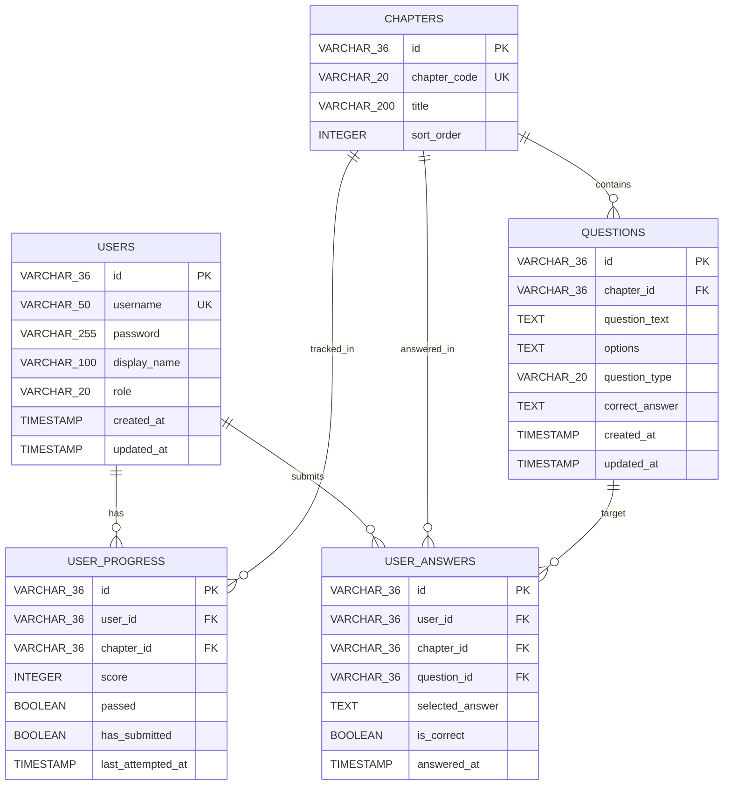

# ER Diagram / ER図

## Overview / 概要

このER図は `src/main/resources/schema.sql` をもとに、`team4-java-exam-v2` の主要テーブル構成とリレーションを Mermaid 記法で表したものです。

- `users`: ログインユーザー情報
- `chapters`: 学習章情報
- `questions`: 各章に属する問題
- `user_progress`: ユーザーごとの章別進捗
- `user_answers`: ユーザーごとの問題回答履歴

## Mermaid

## Notes / 補足

- `user_progress` には `UNIQUE(user_id, chapter_id)` 制約があります。
- `user_answers` には `UNIQUE(user_id, chapter_id, question_id)` 制約があります。
- `questions.chapter_id` は `chapters.id` を参照します。
- `user_progress.user_id` は `users.id`、`user_progress.chapter_id` は `chapters.id` を参照します。
- `user_answers.user_id` は `users.id`、`user_answers.chapter_id` は `chapters.id`、`user_answers.question_id` は `questions.id` を参照します。
- 外部キーはいずれも `ON DELETE CASCADE` です。
