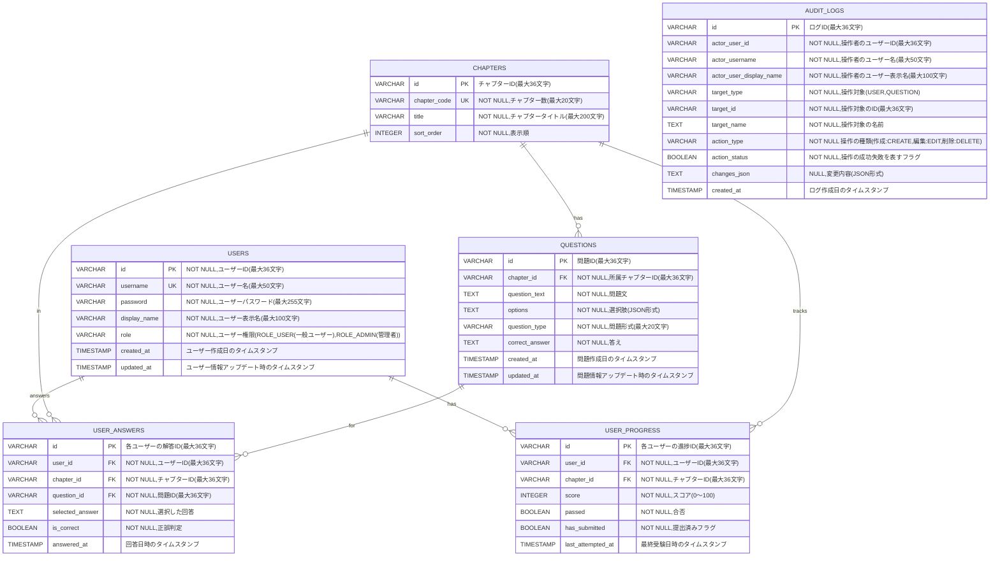

# ER Diagram / ER図

## Overview / 概要

このER図は `src/main/resources/schema.sql` をもとに、`team4-java-exam-v2` の主要テーブル構成とリレーションを Mermaid 記法で表したものです。

- `users`: ログインユーザー情報
- `chapters`: 学習章情報
- `questions`: 各章に属する問題
- `user_progress`: ユーザーごとの章別進捗
- `user_answers`: ユーザーごとの問題解答履歴

## ER Diagram (Mermaid) / ER図（Mermaid記法）

## Relationship Details / リレーション詳細

| Relation / 関連 | Type / 種別 | 説明 (日本語) |
|---|---|---|   
| CHAPTERS → QUESTIONS | 1 : N (One-to-Many) | 各章は0個以上の問題を持つ |
| USERS → USER_PROGRESS | 1 : N (One-to-Many) | 各ユーザーは0以上の章の進捗を持つ |
| CHAPTERS → USER_PROGRESS | 1 : N (One-to-Many) | 章は0個以上の章の進捗を持つ |
| USERS → USER_ANSWERS | 1 : N (One-to-Many) | ユーザーはは0個以上の解答を持つ |
| QUESTIONS → USER_ANSWERS | 1 : N (One-to-Many) | 問題は0個以上のUSER_ANSWERを持つ |
| USER → AUDIT_LOGS | 1 : N (One-to-Many) | ユーザーは0個以上のAUDIT_LOGSを持つ |

## Constraints / 制約

| Table / テーブル | Column / カラム | 制約 (日本語) |
|---|---|---|
| users | id | PK / NOT NULL / ユーザーID(最大36文字) |
| users | username | UK / NOT NULL / ユーザー名(最大50文字) |
| users | password | NOT NULL / パスワード(最大255文字) |
| users | display_name | NOT NULL / 表示名(最大100文字) |
| users | role | NOT NULL / ROLE_USER / ROLE_ADMIN |
| users | created_at | NOT NULL / 作成日時 |
| users | updated_at | NOT NULL / 更新日時 |
| chapters | id | PK /  NOT NULL / チャプターID(最大36文字) |
| chapters | chapter_code | UK / NOT NULL / チャプターコード(最大20文字) |
| chapters | title | NOT NULL / チャプタータイトル(最大200文字) |
| chapters | sort_order |  NOT NULL / 表示順 |
| questions | id | PK / NOT NULL / 問題ID(最大36文字) |
| questions | chapter_id | FK / NOT NULL / ユーザーID(最大36文字) |
| questions | question_text | NOT NULL / 問題文 |
| questions | options | NOT NULL / 選択肢(JSON形式) |
| questions | question_type | NOT NULL / 問題形式(最大20文字) |
| questions | correct_answer | NOT NULL / 正解 |
| questions | created_at | NOT NULL / 作成日時 |
| questions | updated_at | NOT NULL / 更新日時 |
| user_progress | id | PK / 各ユーザーの進捗ID(最大36文字) |
| user_progress | user_id | FK(→ users.id) / NOT NULL / ユーザーID(最大36文字) |
| user_progress | chapter_id | FK(→ chapters.id) / NOT NULL / チャプターID(最大36文字) |
| user_progress | score | NOT NULL / スコア(0〜100) |
| user_progress | passed | NOT NULL / 合否 |
| user_progress | has_submitted | NOT NULL / 提出済みフラグ |
| user_progress | last_attempted_at | 最終受験日 |
| user_progress |  (user_id, chapter_id) | UNIQUE |
| user_answers | id | PK / NOT NULL / 解答ID(最大36文字) |
| user_answers | user_id | FK(→ users.id) / NOT NULL / ユーザーID(最大36文字) |
| user_answers | chapter_id | FK(→ chapters.id) / NOT NULL / チャプターID(最大36文字) |
| user_answers | question_id | FK(→ questions.id) / NOT NULL / 問題ID(最大36文字) |
| user_answers | selected_answer | NOT NULL / 選択した回答 |
| user_answers | is_correct | NOT NULL / 正誤判定 |
| user_answers | answered_at | 回答日時 |
| user_answers | (user_id, chapter_id, question_id) | UNIQUE |
| users / chapters / questions / user_progress / user_answers | id | PK / NOT NULL |
| 各テーブル | 外部キー（user_id / chapter_id / question_id） | ON DELETE CASCADE |
| AUDIT_LOGS | `id` | Primary Key, VARCHAR(36) | 主キー |

## Notes / 補足

- `user_progress` には `UNIQUE(user_id, chapter_id)` 制約があります。
- `user_answers` には `UNIQUE(user_id, chapter_id, question_id)` 制約があります。
- `questions.chapter_id` は `chapters.id` を参照します。
- `user_progress.user_id` は `users.id`、`user_progress.chapter_id` は `chapters.id` を参照します。
- `user_answers.user_id` は `users.id`、`user_answers.chapter_id` は `chapters.id`、`user_answers.question_id` は `questions.id` を参照します。
- 外部キーはいずれも `ON DELETE CASCADE` です。
